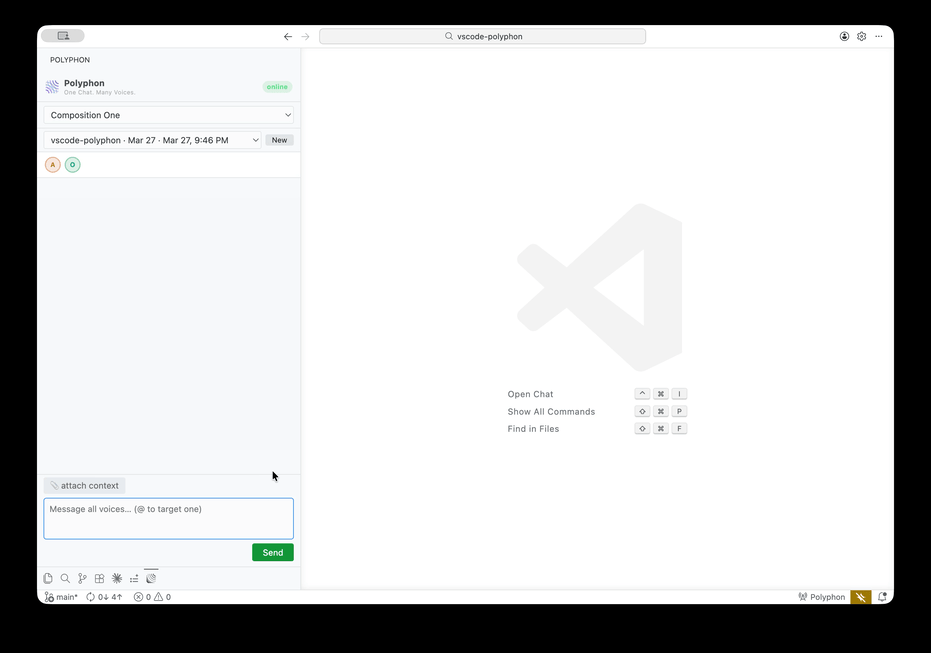

# Polyphon for VS Code

[](https://marketplace.visualstudio.com/items?itemName=polyphon-ai.vscode-polyphon) [](https://github.com/polyphon-ai/vscode-polyphon/releases/latest) [](LICENSE) [](https://x.com/intent/follow?screen_name=PolyphonAI)

A VS Code extension that connects to a running [Polyphon](https://polyphon.ai) instance, letting you have multi-voice AI conversations from within your editor — with full awareness of your open file, selection, and errors.



## Requirements

- [Polyphon](https://polyphon.ai) must be installed and running locally (desktop app)
- VS Code 1.85 or later

## Installation

### VS Code Marketplace

Search for **Polyphon** in the Extensions panel (`Cmd/Ctrl+Shift+X`), or install directly from the [VS Code Marketplace](https://marketplace.visualstudio.com/items?itemName=polyphon-ai.vscode-polyphon).

### Manual installation (VSIX)

1. Download the `.vsix` from the [latest release](../../releases/latest)
2. In VS Code: **Extensions** → **⋯** → **Install from VSIX…**
3. Select the downloaded file

## Configuration

Open **Settings** (`Cmd/Ctrl+,`) and search for `polyphon`:

| Setting | Default | Description |
|---------|---------|-------------|
| `polyphon.host` | `127.0.0.1` | Host of your Polyphon instance |
| `polyphon.port` | `7432` | TCP port Polyphon is listening on |
| `polyphon.token` | *(empty)* | API token — use the **Polyphon: Read Local API Token** command to load automatically |

The API token is stored at `~/Library/Application Support/Polyphon/api.key` on macOS. Run **Polyphon: Read Local API Token** from the Command Palette to populate it automatically.

## Usage

1. Start Polyphon
2. Open the Polyphon panel — click the icon in the Activity Bar, or run **Polyphon: New Session** from the Command Palette
3. The extension connects automatically; the status bar shows `$(radio-tower) Polyphon` when connected
4. Select a composition from the dropdown
5. Choose or create a session
6. Type a message and press **Send** or `Enter`

Each voice in the composition responds in the unified thread, labeled by name. Use `@VoiceName` to target a specific voice.

### Voice targeting

Type `@` in the message field to see a dropdown of voices in the current composition. Select one to direct your message to that voice only.

### Code context

Click **📎 attach context** before sending to include:

- The path of your currently open file
- Any selected text (as a fenced code block)
- Active error diagnostics in the selected range

The context is prepended to the message sent to Polyphon. Only the plain message text is shown in the conversation panel.

### Right-click menu

Select code in the editor, right-click, and choose **Polyphon: Ask About Selection** to open the sidebar with the selection pre-filled.

## Commands

| Command | Description |
|---------|-------------|
| `Polyphon: Connect` | Manually connect to Polyphon |
| `Polyphon: Disconnect` | Disconnect from Polyphon |
| `Polyphon: New Session` | Create a new session in the active composition |
| `Polyphon: Ask About Selection` | Open the sidebar with the current selection pre-filled |
| `Polyphon: Read Local API Token` | Auto-populate the API token from the running Polyphon instance |

## Development

```sh
npm install
npm run dev      # build (non-production)
npm run build    # type-check + production build
npm run package  # build + package as .vsix
npm run lint     # ESLint
```

To run the extension in a development host, open this folder in VS Code and press **F5**.

See [CONTRIBUTING.md](CONTRIBUTING.md) for architecture details and contribution guidelines.

## Community

- [Join the discussion](https://github.com/polyphon-ai/.github/discussions) — questions, ideas, and feedback
- [Open an issue](https://github.com/polyphon-ai/vscode-polyphon/issues) — bug reports and feature requests

## License

MIT — see [LICENSE](LICENSE)
